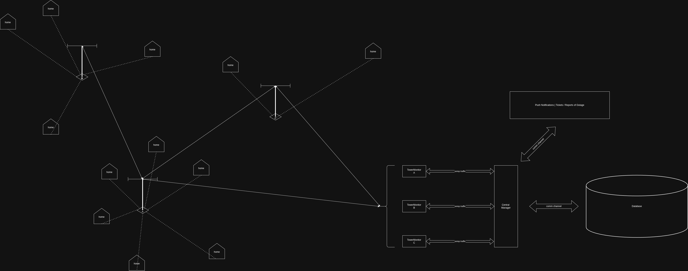

# Status Page Active Response Coordination (SPARC)

### Salesforce Apex Actions & Infrastructure Automation

## Project Overview

A network of towers supports users on the grid. If one tower goes down, it is
assumed that the network is resilient enough to support customers affected by the
outage. However, sometimes this is not always the case and an node in the network
is/can not be supported by an additional tower. 

In both scenarios, it is important to notify customers about the impact of an
outage and the steps the company is taking to correct the issue.


Database:

```rust

TowerTable:
  Name<String>
  Location<Coord>
  Status<SNMP>
  Neighbors<Tower>

CustomerTable:
  Name<String>
  Address<Address>
  Contact<ContactInfo>

```


---

## Architecture





---

## Measurable Business Impact

* **Support Center Mitigation:** Proactively alerting affected subscribers via SMS drops customer service call queues to near zero for anticipated localized events.
* **Optimized Dispatch (MTTR):** Technicians are staged and routed with appropriate equipment before the asset undergoes critical failure, ensuring higher first-time-fix rates.
* **Controlled Change Management:** Following standard DevOps practices, all metadata modifications, Flow structures, and Apex source changes are tracked with Git.


